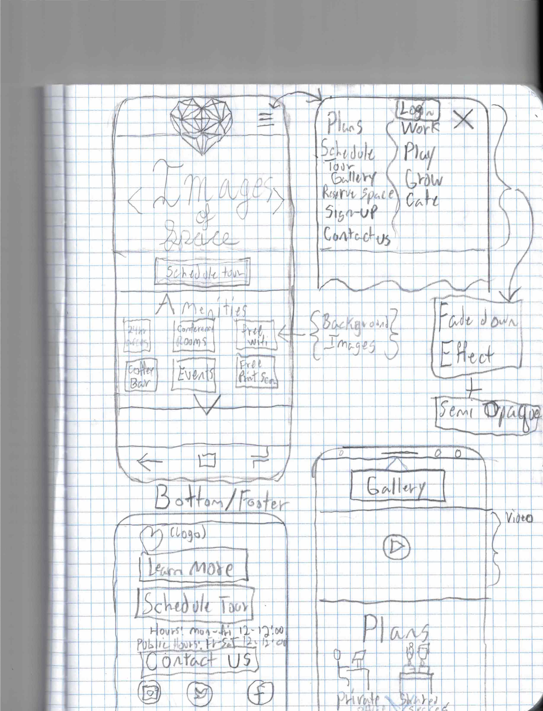

# Freelance Co-Working

This project was generated with [Angular CLI](https://github.com/angular/angular-cli) version 1.6.5.

##  Research - Inspire - Brainstorm

* Client Request's
  * "We just finished remodeling our space. We're really proud of it. We want our online presence to mirror our in-person presence, to attract people that would really enjoy working in our environment."
  * "We want our space--no, our whole company--to feel a little luxurious, cool, and high-end; yet still absolutely 100% welcoming, approachable and inclusive to anyone and everyone. A safe, comfortable, and productive work environment, you know?"
  * "I also think it's really important convey our unique personality. It's what sets us apart from the 'big guys' in the coworking field. You know, places like WeWork and TechSpace. We think we're more funky, more local, less corporate, and a little more fun."
  * I want to avoid catering to tech. You walk into some of these other coworking spaces, and you only ever see people working on code. That's great, but we'd also love to see artists, daytraders, writers, counselors, more traditional business people--you know, anyone and everyone--in our space."
  * "It should also be easy to see what amenities we have. We have an on-site coffee counter, both communal working areas and private offices, high-speed internet, printing and faxing services, and we usually have a fun, optional activity on Thursday afternoons. Like yoga, maybe a fun complementary food, or like...I don't know, a craft or something?"

####  Photo's of working space

 

#### Client Logo

 
 

 
 

#### Client Colors
* <strong> Green </strong>

* <strong>Pink / Salmon - love</strong>

#### Possible Colors
  * <strong>Gold (for luxurious)</strong>

  * <strong>Silver</strong>

    * Where gold is masculine, silver is considered as feminine energy.
  * Metallic

 
 
 

#### Ideas:
  * Animate heart Logo
    * Animated with toroidal effect, heart spinning around it's center.
  * Animate Grow link
    * Animate with growing tree - symbolizes growth, goes with flexibility of yoga, and fits with green theme
      * animation during mouse hover or after mouse click

## Sketch <a>A wild sketch appears!</a>

## Setup/Installation Requirements

### I. Backend

Add instructions.

### II. Node & NPM Installs

1. Install Node.js on local machine.
2. Install TypeScript globally: `npm install -g typescript`
3. Install Angular CLI globally: `npm install -g @angular/cli@1.7.4`

### III. View Project

Add instructions.

## Known Bugs

- None.

## Technologies Used

* Angular

## Development server

Run `ng serve` for a dev server. Navigate to `http://localhost:4200/`. The app will automatically reload if you change any of the source files.

## Build

Run `ng build` to build the project. The build artifacts will be stored in the `dist/` directory. Use the `-prod` flag for a production build.

## Further help

To get more help on the Angular CLI use `ng help` or go check out the [Angular CLI README](https://github.com/angular/angular-cli/blob/master/README.md).

<link rel="stylesheet"  href="https://cdnjs.cloudflare.com/ajax/libs/github-markdown-css/2.10.0/github-markdown.css">
